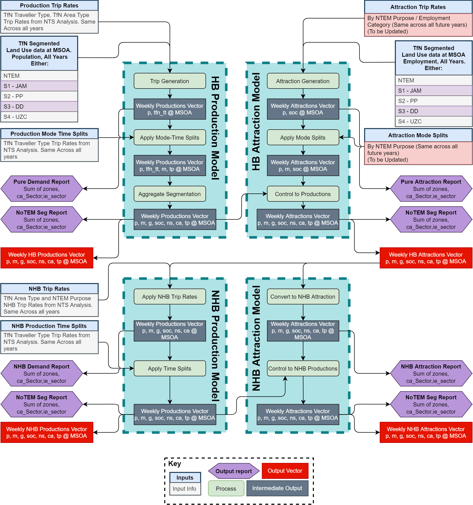
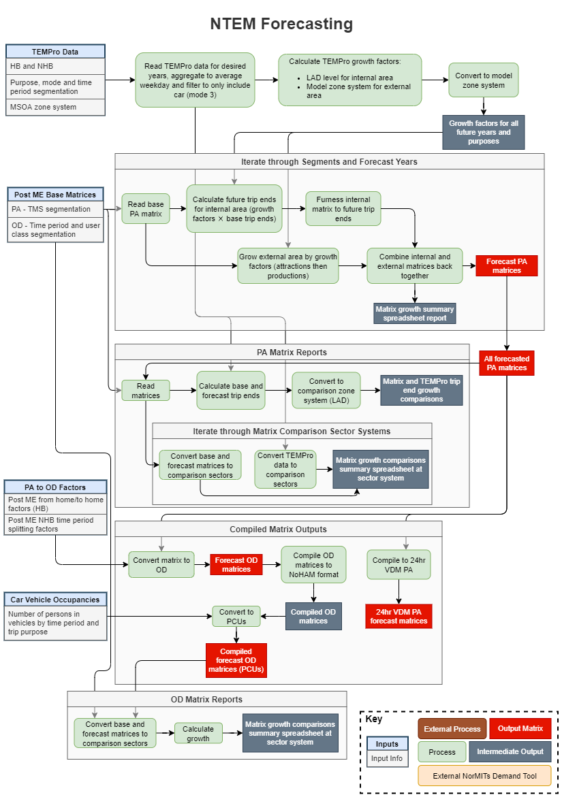

<h1 align="center">NorMITs Demand</h1>

In short, NorMITs Demand is Transport for the North's (TfN) mainland GB
demand tools.
These tools started out as Northern specific models, however they are
currently moving towards more flexible zoning to allow them to be applicable
to elsewhere in mainland GB too.

We're keen to support sharing these tools where we can,
see [support](#sharing) for more information.

#### Contents
 - [Summary](#summary) 
 - [Quick Start Guide](#quick-start-guide)
 - [Required Data](#required-data)
   - [NoTEM](#notem)
   - [TMS](#tms)
   - [EFS](#efs)
   - [Elasticity](#elasticity)
 - [Documentation](#documentation)
 - [Planned Improvements](#planned-improvements)
 - [Sharing](#sharing)
   - [Sharing Models](#sharing-models)
   - [Sharing Requests](#sharing-requests)
 - [Gory Details](#gory-details)
   - [Northern Trip End Model](#northern-trip-end-model)
   - [Travel Market Synthesiser](#travel-market-synthesiser)
   - [External Forecast System](#external-forecast-system)
   - [NTEM Forecasting](#ntem-forecasting)
   - [Elasticity](#elasticity-model)
   - [NorMITs Matrix Tools](#matrix-tools)

## [Summary](#contents)
NorMITs Demand is made up of a number of smaller models, each with their own
individual purpose.
For further information on how these models work, click the links in their names.
Currently, the NorMITs Demand models are capable of building the following:
- [Northern Trip End Model](#northern-trip-end-model) (**NoTEM**) -
  MSOA modelled trip ends (base and future year)
  based on the provided
  [Land Use](https://github.com/Transport-for-the-North/Land-Use) and 
  [National Transport Survey data](https://github.com/Transport-for-the-North/NTS-Processing).
- [Travel Market Synthesiser](#travel-market-synthesiser) (**TMS**) -
  Builds the synthetic base year matrices, by distributing
  the trip end data provided by NoTEM.
- [External Forecast System](#external-forecast-system) (**EFS**) - 
  Future Year forecast matrices, built on top of the 
  Post-Matrix-Estimation matrices provided, the trip ends from NoTEM, and
  the more accurate distributions from TMS.
- [Elasticity Model](#external-forecast-system) -
  Cost-change adjusted future year forecast matrices, taking exogenous
  cost changes into account, and adjusts the outputs of the EFS matrices.
- [NorMITs Matrix Tools](#matrix-tools) -
  A collection of tools for manipulating matrices that underpins much of 
  the work done by TMS and EFS.

NorMITs  Demand has been built in a modular way, so that each sub-model can
be swapped out for any model that uses the same inputs to make the same outputs.
For example, if you already have a set of base and future year trip ends that
you would like to use in-place of NoTEM, they can be slotted in.
How these models interact can be seen below, grey and red boxes indicate where
alternate inputs/outputs could be used:

## [Quick Start Guide!](#contents)
This section will be updated on more detail once we've produced a front-end
to all our models, making the interaction between each much simpler!

## [Required Data](#contents)
To get NorMITs Demand running numerous data inputs are required.
Due to the nature of the data required licenses are needed, therefore we
are unable to share this data alongside our models here. For more information
on how to get hold of this data, please see the [sharing](#sharing) section.

As mentioned above NorMITs Demand is modularised, therefore each model
requires a different set of inputs. Some models will feed data into others,
it will be made clear where this is possible.

### [NoTEM](#contents)
NoTEM is the most complex model in terms of inputs.
The inputs are described in more detail [later on](#northern-trip-end-model).
Briefly, these inputs can be broken down into: Land Use data, trip rates, and
splitting factors.

#### Inputs
Land Use data covers residential (where people live) and non-residential
(shops/work/schools) data, currently this needs to be segmented by MSOA for 
NoTEM to be able to pick it up. We're working on making this more flexible.
Land Use data is required for every year that trip ends need to be produced 
for.

Trip rates are the crucial input for converting Land Use data into productions
and attractions. Our trip rates are extracted from analysis of
[National Transport Survey](https://beta.ukdataservice.ac.uk/datacatalogue/studies/study?id=7553)
data.

Splitting factors are the various types of splits that are used by NoTEM to 
split data into categories such as mode shares and time period splits. Similar
to trip rates, our various splitting factors come from analysis of 
National Transport Survey data.

#### Outputs
NoTEM outputs 4 sets of trip ends per year: 
home-based productions, home-based attractions,
non-home-based productions, and non-home-based attractions.
These trip end outputs can be fed into TMS and EFS.
By default there are segmented by:

| Segment          | Description        | Categories |
|------------------|--------------------|------------|
| Purpose          | As NTEM            | 14         |
| Mode             | As NTEM            | 5 (No M4)  |
| Gender           | As NTEM            | 3          |
| Soc              | Skill Level Proxy  | 4          |
| Ns-SeC           | Income Level Proxy | 5          |
| Car Availability | Simplified NTEM    | 2          |
| Time Period      | As NTEM            | 6          |

### [TMS](#contents)
TMS is designed to take the base year trip ends and accurately distribute 
them into a synthetic trip matrix. Once the trip ends are made, the inputs 
to TMS are comparatively simpler.

#### Inputs
Firstly, TMS requires a set of trip ends to distribute. Segmentations used
here are usually fairly aggregate compared to NoTEM outputs so the sample 
sizes stay significant.

The zoning system that TMS is to run at needs to be defined, along with an 
"internal" and an "external" definition of zones. The internal area is the
area of focus, whereas the external area would be the rest of mainland GB,
and would be more disaggregate.

To aid distribution TMS requires some segmented cost distributions to
aim towards while distributing the given trip ends. 
Alongside this, a set of cost matrices that define the cost between each and
every zone is required.

#### Outputs
TMS outputs a set of Production-Attraction (*PA*) base year matrices.
These matrices will be segmented the same as the input data.
The outputs matrices can be used by EFS as the base year distributed demand 
on which the future year demand is based off of.

### [EFS](#contents)
EFS in its simplest form is designed to take the base and future year synthetic
trip ends alongside a set of post-matrix-estimation (*post-ME*) matrices.
The synthetic data is then used to grow the post-ME matrices into future years
and re-distribute.
More detail on what EFS can take into account in future years can be found
[here](#external-forecast-system).

#### Inputs
Firstly, EFS requires a set of base and future year trip ends to distribute,
these can be supplied by NoTEM.
As the post-ME matrices should be quite accurately distributed, the EFS trip
ends can be more segmented than the TMS ones.

EFS also requires a set of Post-ME matrices to base its future year matrices
off of.
These matrices should be as accurate as possible to produce more accurate
future year predictions.

#### Outputs
EFS outputs a set of PA future year matrices.
EFS outputs a set of PA future year matrices.
The outputs can be further fed into the Elasticity Model to reflect
exogenous cost changes on demand.

### [Elasticity](#contents)
Lastly, the elasticity model aims to take a set of future year PA matrices
alongside a set of future cost changes.
The cost changes are then applied to the demand represented in the PA
matrices, moving demand between different modes of transport.

#### Inputs
First, the elasticity requires the PA matrices to adjust.
These can be provided by the EFS.

Second, the elasticity requires some cost definitions:
- The desired cost adjustments. Proportional and by cost component.
- A definition of how to calculate Generalised Cost from the cost components.
- A definition of the costs between each and every zone.

#### Outputs
The elasticity model outputs set of cost adjusted PA future year matrices.
These outputs will be in the same format as the input matrices, but with
adjustment factors applied.

## [Documentation](#contents)
Current code documentation can only be found in the codebase.
Planned improvements include hosting this online, so it's easily
accessible!

## [Planned Improvements](#contents)
This section is a work in progress and will be updated with more detail.
Planned updates include:
- Online hosting of documentation
- NoTEM
  - Zoning system flexible
  - Northern tram infill
  - Integration of visitor economy data
  - Improvement of attraction modelling
- Multi-Modal TMS running (currently only car and rail)
  - Improved multi-cost-distribution gravity model calibration
- Multi-Modal EFS running (currently only car and rail)

## [Sharing](#contents)
TfN's Technical Assurance, Modelling and Economics (**TAME**) team have done
a great deal of work to develop TfN’s Analytical Framework.
As part of this, we would like to start sharing some of our tools, NorMITs 
Demand included.

### [Sharing Models](#contents)
We've categorised out ways of sharing into 3 different profiles, each with 
a distinct risk/reward profile.

#### 1. Utilisation of Open Source tools and casual TfN support.
This includes forking our repository and mostly working without TfN support.
This profile would be facilitated though submitting issues and TfN clarification
supporting where possible.

#### 2. TfN Builds outputs *for* requester
Data requests will be submitted using the [requests](#sharing-requests) process.
TfN will then assess the feasibility, and aim to build and hand over the
required outputs.

#### 3. TfN Builds outputs *with* requester 
Data requests will be submitted using the [requests](#sharing-requests) process.
TfN will then assess the feasibility, and a discussion will begin to decide how
best to work together to produce the required output.

### [Sharing Requests](#contents)

If you are interested in acquiring any of the data, or would like some support
in utilising NorMITs Demand, please submit your requests to
data.requests@transportforthenorth.com.

All requests should contain the following information:
- Requestor Name
- Requestor Organisation
- Request Date
- Required by date
- Expected deliverables
- Format required, where possible
- Purpose of data
- Will data be published?
- Comments

Please note that the TAME team are in high demand with limited resources so
responses to requests may not be immediate.
However, the team will endeavour to provide you with an estimate of how long
it would take to share the data.

## [Gory Details](#contents)
This section talks about how each of the models in the NorMITs Demand suite work
in detail. It will provide more insight into the transport methodologies used,
and the coding detail that makes it so fast. If you are looking for more of an 
overview, look [here](#summary)!

This section is currently a work in progress and will be updated.
An overview of the points we plan to provide more information on can be found
in each section.

### [Northern Trip End Model](#contents)
- DVector - how NoTEM runs quickly
- Flexible zoning - how to use
- Flexible segmentation - how to use
- Tram infill

### [Travel Market Synthesiser](#contents)
- 3 dimensional Furness
- Gravity Model
- Upper and Lower tier distributions

### [External Forecast System](#contents)
- Working from home adjustments
- Bespoke zone handling

### [NTEM Forecasting](#contents)

### [Elasticity Model](#contents)
- Types of elasticities
- VoT/VoC adjustments
- Generalised Cost approach

### [Matrix Tools](#contents)
- Segment Tier Converter
- PA to OD conversion
- OD to PA conversion
